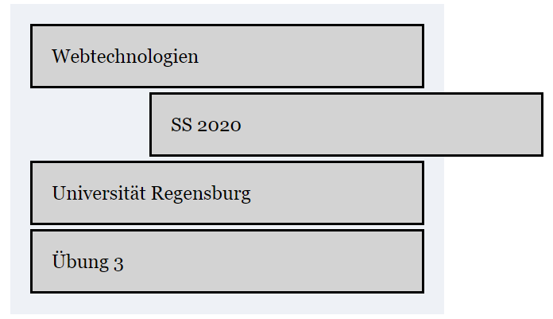

# 04 | CSS Box Model

## Aufgabe 1: CSS Grundlagen Mozilla Developer Guides (Teil 2)

Schließen Sie das Modul **CSS First Steps** der _Mozilla Developer Guides_ unter https://developer.mozilla.org/en-US/docs/Learn/CSS/First_steps ab, indem Sie die Tutorials

- What is CSS?
- Getting started with CSS
- How CSS is structured
- How CSS works
- Using your new knowledge

durchführen. Nutzen Sie den auf der Webseite integrierten interaktiven Editor, um die praktischen Übungen zu machen.

## Aufgabe 2: Element-Positionierung in CSS

Bauen Sie in dieser Aufgabe das vorgegebene HTML-Dokument nach (siehe unten) und verändern Sie die Positionen der einzelnen div-Elemente mit Hilfe der _position_ Eigenschaften von CSS. Erstellen Sie fünf CSS-Dateien für Ihr HTML-Dokument. Sie können sich am Beispiel der Vorlesung orientieren.

{  }

{  }

{  }

{  }

{  }

Weitere Informationen zur _position_ Eigenschaft in CSS erhalten Sie [\textcolor{blue}{hier}](https://developer.mozilla.org/en-US/docs/Web/CSS/position). 

------

*Abgabekriterien:*

Laden Sie Ihre Antworten bis spätestens 23.05.2022 (23:59 Uhr) als zip-komprimierten Ordner auf GRIPS hoch.  Benennen Sie die einzelnen Dateien pro Aufgabe sinnvoll und verwenden Sie geeignete Formate:

- Aufgabe 2: Ihre 5 CSS-Dateien  (Eine CSS für das Startdesign, Vier CSS Dateien für jede Variante)

Der Name der Datei ergibt sich aus dem Präfix „Übung_WT_SS22“, der Nr. des Übungsblattes, ihrem Vor- und Nachnamen jeweils getrennt durch _ .

 

Beispiel: **Übung_WT_SS22_4_Max_Mustermann.zip**

